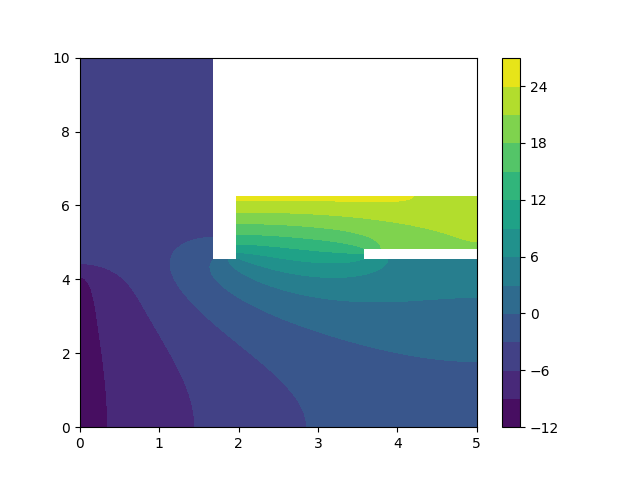

# Projet Maillage et Elements Finis

Projet de Maillage et Éléments Finis, implémenté par `Clément Apavou` et `Arthur Zucker`.

## Structure 
```
├── Classe            
│   ├── Matrice.py              # Fonctions pour assemblage des matrices A et B du système AU = B
│   ├── Mesh.py                 # Classes Mesh, Triangle, Segment et Point 
│   ├── triplets.py             # Classe Triplets necessaire pour le format CSR
├── Figures                     # Contient les rendus 
│   ├── appartement.png         # Appartement énoncé
│   ├── config_1.png            # Appartement d'Arthur : configuration 1 
│   ├── config_2.png            # Appartement d'Arthur : configuration 2
│   ├── config_3.png            # Appartement d'Arthur : configuration 3
├── Images                       
|   ├── 2020-2021-flat.svg      # Image de l'appartement de l'énoncé
│   ├── equation1.svg           # Équation de l'énoncé
│   ├── equation2.svg           # a(u,v) = l(v)
├── Immobilier       
│   ├── appartement_arthur      # Essaie de dfférentes position du radiateur dans l'appartement d'Arthur
|   |   |── fichier_msh
|   │   |   ├── config_1.msh    # Configuration 1
|   │   |   ├── config_2.msh    # Configuration 2
|   │   |   ├── config_3.msh    # Configuration 3
│   |   ├── config_1.py         # Appartement d'Arthur : configuration 1 
│   |   ├── config_2.py         # Appartement d'Arthur : configuration 2
│   |   ├── config_3.py         # Appartement d'Arthur : configuration 3
│   ├── appartement.geo         # Fichier .geo permettant de générer l'appartement de l'énoncé 
│   ├── appartement.msh         # Fichier .msh : maillage de l'appartement de l'énoncé   
│   ├── appartement.py          # Fichier .py permettant de générer l'appartement de l'énoncé    
├── python_librairies_pip.bat   # fichier permettant d'installer les librairies python necessaires 
├── resolution.py               # fichier permettant de résoudre le problème à l'aide des élements finis P1
└── README.md
```
## Installation des librairies python via pip

Lancer la commande `sh python_librairies_pip.bat`<br/>
Les librairies qui vont être installées sont: 
* alive-progress
* numpy
* scipy
* matplotlib
* docopt

##  Énoncé


Une condition de Neumann homogène et deux conditions de Dirichlet hétérogène.

## a(u,v) = l(v)


Dans le système AU = B, il n'y aura donc pas de matrice de masse à calculer pour A et pas de méthode de quadrature à faire pour le calcul de B.

## Utilisation du code
Pour résoudre le problème, il faut lancer le code resolution.py via la commande `python resolution.py <name>`, la figure de la solution s'affichera et sera également créée dans le repertoire `Figures` . <br/> 
`name` peut prendre plusieurs valeurs : <br/>
* appartement (appartement de l'énoncé) : `python resolution.py appartement`
* config_1 (appartement d'Arthur configuration 1) : `python resolution.py config_1`
* config_2 (appartement d'Arthur configuration 2) : `python resolution.py config_2`
* config_3 (appartement d'Arthur configuration 3) : `python resolution.py config_3`

## Appartement énoncé

### Les paramètres : 
* La finesse du maillage `h = 0.5`                   
* Longueur appartement `L = 10`
* Largeur appartement `l = 10`
* Épaisseur des murs `d = 0.5`
* Longueur d’une fenêtre `Lf = 2`
* Longueur d’une radiateur `Lr = 2`
* `Tc = 25`
* `Tf = -10`

#### Résultat pour la commande python resolution.py appartement


## Détermination de la position du radiateur dans l'appartement d'Arthur

Arthur a très froid en ce moment il ne sait pas où mettre le radiateur dans son appartement. À l'aide de la méthode des élements finis P1, nous allons determiner où est ce que Arthur doit mettre son radiateur. 
Nous avons essayé trois configurations différentes.

### Configuration 1 : à côté de son lit ?

`python resolution.py config_1`


Cette configuration semble pas mal. Le radiateur diffuse bien la chaleur dans les pièces principales de son appartement (même si il ne possède que deux pièces).

### Configuration 2 : dans la salle de bain ?

`python resolution.py config_2`



Les murs de la sale de bain attenuent la propagation de la chaleur dans tout l'appartement. Dans cette configuration, il aura chaud quand il prendra une douche ! 

### Configuration 3 : dans le couloir de l'entrée à côté de la fenêtre ?

`python resolution.py config_3`


Cette configuration juste à côté de la fenêtre est la moins bonne car avoir de la chaleur dans le couloir d'entrée n'est pas vraiment utile. 

### Verdict

La configuration 1 semble la meilleure.
